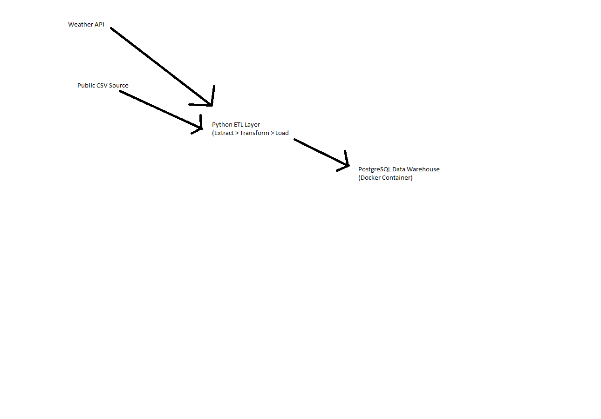

# Automated Data Warehouse (Python + Docker + PostgreSQL)

## Overview
This project contains an ETL pipeline that:
Extracts weather data from an API
Extracts public CSV data
Transforms both datasets
Loads them into a PostgreSQL Data Warehouse

## Architecture

## Features
Dockerized PostgreSQL Warehouse
Python ETL using SQLAlchemy, Pandas, Requests
SQL schema files included
Easily extendable to Airflow, dbt, S3

## Quickstart
docker-compose up -d
python3 etl/etl_weather_csv_to_postgres.py
psql -h localhost -U etl -d warehouse